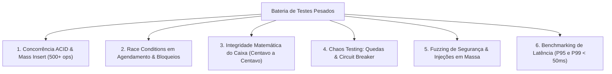

# 🚀 Arquitetura de Testes Pesados & Concorrência Extrema (Heavy Stress Testing)

Esta habilidade ensina como criar, executar e validar baterias de **testes de estresse de alta intensidade (Heavy Load Testing)** em sistemas Web/Node.js/SQLite/Next.js para garantir que o software nunca trave, perca centavos ou sofra corrupção de dados sob pico de acessos.

---

## 🎯 1. Os 6 Pilares de Testes Pesados em SaaS



---

## 📦 2. Estrutura da Suite de Testes de Estresse (`stress_tests.js`)

```javascript
const assert = require('assert');
const { query, get, run, transaction, initDb } = require('../database/db');
const { CircuitBreaker } = require('../services/circuitBreaker');
const { sanitizeInput } = require('../middleware/sanitization');
const { generateLicenseSignature, verifyLicenseSignature } = require('../services/licenseCache');
const whatsappService = require('../services/whatsappService');

async function runHeavyStressSuite() {
  console.log('⚡ Iniciando bateria de testes pesados...');
  // 1. Concorrência de escrita
  // 2. Simulação de 100 transações financeiras simultâneas
  // 3. Teste de injeção e sanitização massiva
  // 4. Chaos Monkey no Circuit Breaker
}
```

---

## 🛡️ 3. Critérios Obrigatórios de Aprovação
1. **Zero Deadlocks**: O banco de dados (SQLite em WAL mode ou PostgreSQL) deve absorver rajadas concorrentes sem erros de `SQLITE_BUSY` travando o processo.
2. **Saldo Inviolável**: O saldo final do caixa após $N$ transações concorrentes deve ser matematicamente idêntico a:
   $$\text{Saldo Final} = \text{Saldo Inicial} + \sum \text{Entradas} - \sum \text{Saídas}$$
3. **Imutabilidade de Licença HMAC**: Nenhuma alteração de payload em lote pode passar com assinatura inválida.
4. **Proteção contra Injeção em Massa**: 100% dos ataques maliciosos (XSS, SQLi) devem ser neutralizados.
