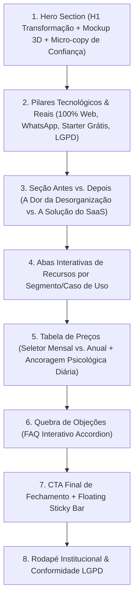

# 🚀 Skill: SaaS High-Converting Landing Page Architecture

Esta skill documenta o padrão de arquitetura de **Landing Page de Alta Conversão** para produtos **SaaS Web (Next.js + Tailwind CSS)**. Ela foi projetada para maximizar taxas de cadastro e ativação sem uso de dados falsos, priorizando clareza, velocidade de carregamento e persuasão ética.

---

## 🎯 1. Estrutura Estratégica das Dobras (Copy & Wireframe)



---

## 💻 2. Componente Completo da Landing Page (`src/app/page.tsx`)

```tsx
"use client";

import React, { useState, useEffect } from "react";
import Link from "next/link";
import {
  Zap,
  CheckCircle2,
  ArrowRight,
  ShieldCheck,
  Droplets,
  Wrench,
  ShoppingCart,
  MessageSquare,
  Sparkles,
  Check,
  X,
  BarChart3,
  Flame,
  Award,
  ChevronDown,
  TrendingUp,
} from "lucide-react";

export default function LandingPage() {
  const [billingPeriod, setBillingPeriod] = useState<"monthly" | "annual">("annual");
  const [activeTab, setActiveTab] = useState<"oficina" | "lavajato" | "gestao">("oficina");
  const [openFaq, setOpenFaq] = useState<number | null>(null);
  const [showFloatingCta, setShowFloatingCta] = useState(false);

  // Exibe Floating CTA ao rolar a página
  useEffect(() => {
    const handleScroll = () => {
      if (typeof window !== "undefined") {
        setShowFloatingCta(window.scrollY > 600);
      }
    };
    window.addEventListener("scroll", handleScroll);
    return () => window.removeEventListener("scroll", handleScroll);
  }, []);

  const toggleFaq = (index: number) => {
    setOpenFaq(openFaq === index ? null : index);
  };

  return (
    <div className="space-y-24 pb-20 font-sans text-slate-900 selection:bg-blue-600 selection:text-white">
      {/* 🚀 1. HERO SECTION & PROPOSTA DE VALOR */}
      <section className="relative pt-6 sm:pt-12 pb-8 text-center max-w-5xl mx-auto space-y-8">
        <div className="inline-flex items-center gap-2 px-4 py-2 rounded-full bg-gradient-to-r from-blue-50 to-indigo-50 border border-blue-200 text-blue-700 text-xs font-extrabold shadow-sm animate-pulse">
          <Flame className="w-4 h-4 text-amber-500 fill-current" />
          <span>O ERP Mais Moderno • 100% na Nuvem</span>
        </div>

        <h1 className="text-3xl sm:text-5xl lg:text-6xl font-black text-slate-950 tracking-tight leading-[1.15]">
          Transforme sua Empresa em um Negócio{" "}
          <span className="bg-gradient-to-r from-blue-600 via-indigo-600 to-amber-500 bg-clip-text text-transparent">
            Organizado e Altamente Lucrativo
          </span>
        </h1>

        <p className="text-base sm:text-xl text-slate-600 max-w-3xl mx-auto leading-relaxed">
          Gerencie operações, pátio Kanban e envie{" "}
          <strong className="text-slate-900 font-bold">avisos automáticos no WhatsApp</strong> do cliente. Sem instalação e sem precisar de cartão de crédito.
        </p>

        <div className="flex flex-col sm:flex-row items-center justify-center gap-4 pt-2">
          <Link
            href="/cadastro"
            className="w-full sm:w-auto px-9 py-4 rounded-2xl bg-gradient-to-r from-blue-600 via-blue-700 to-indigo-700 hover:from-blue-700 hover:to-indigo-800 text-white font-black text-base shadow-xl shadow-blue-600/30 flex items-center justify-center gap-2.5 transition-all transform hover:-translate-y-0.5 active:scale-95"
          >
            <Sparkles className="w-5 h-5 text-amber-300 fill-current" />
            <span>Criar Conta Grátis (2 Usuários)</span>
            <ArrowRight className="w-5 h-5" />
          </Link>

          <Link
            href="#recursos"
            className="w-full sm:w-auto px-7 py-4 rounded-2xl bg-white hover:bg-slate-50 text-slate-800 font-extrabold text-sm border border-slate-300 shadow-sm flex items-center justify-center gap-2 transition-all hover:border-slate-400"
          >
            <span>Ver Como Funciona</span>
            <ChevronDown className="w-4 h-4 text-slate-500" />
          </Link>
        </div>

        {/* Micro-copy de Confiança */}
        <div className="flex flex-wrap items-center justify-center gap-x-8 gap-y-2 pt-2 text-xs font-bold text-slate-600">
          <div className="flex items-center gap-1.5">
            <CheckCircle2 className="w-4 h-4 text-emerald-600" />
            <span>Sem cartão de crédito</span>
          </div>
          <div className="flex items-center gap-1.5">
            <CheckCircle2 className="w-4 h-4 text-emerald-600" />
            <span>Configuração em 2 minutos</span>
          </div>
          <div className="flex items-center gap-1.5">
            <CheckCircle2 className="w-4 h-4 text-emerald-600" />
            <span>Acesso no Celular & PC</span>
          </div>
          <div className="flex items-center gap-1.5">
            <CheckCircle2 className="w-4 h-4 text-emerald-600" />
            <span>Suporte Humanizado</span>
          </div>
        </div>

        {/* MOCKUP INTERATIVO DA INTERFACE */}
        <div className="pt-6">
          <div className="relative mx-auto max-w-5xl rounded-3xl bg-slate-900 p-2 sm:p-4 shadow-2xl ring-1 ring-slate-900/10">
            <div className="rounded-2xl bg-slate-950 p-4 sm:p-6 text-left border border-slate-800 space-y-4">
              <div className="flex items-center justify-between border-b border-slate-800 pb-3">
                <div className="flex items-center gap-2">
                  <div className="w-3 h-3 rounded-full bg-rose-500" />
                  <div className="w-3 h-3 rounded-full bg-amber-500" />
                  <div className="w-3 h-3 rounded-full bg-emerald-500" />
                  <span className="text-xs text-slate-400 font-mono ml-2">app.seusaas.com.br/dashboard</span>
                </div>
                <div className="flex items-center gap-2 text-xs text-emerald-400 font-bold bg-emerald-950/60 px-3 py-1 rounded-full border border-emerald-800">
                  <span className="w-2 h-2 rounded-full bg-emerald-500 animate-ping" />
                  WhatsApp Conectado
                </div>
              </div>

              {/* Grid dos Cards de Demonstração */}
              <div className="grid grid-cols-1 md:grid-cols-3 gap-4 text-xs">
                <div className="bg-slate-900/90 rounded-2xl p-4 border border-cyan-900/40 space-y-3">
                  <div className="flex items-center justify-between font-bold text-cyan-400">
                    <span className="flex items-center gap-1.5"><Droplets className="w-4 h-4" /> Pátio em Tempo Real</span>
                    <span className="bg-cyan-500/20 px-2 py-0.5 rounded-full text-[10px]">3 Itens</span>
                  </div>
                  <div className="bg-slate-800 p-3 rounded-xl border border-slate-700 space-y-1.5">
                    <div className="flex justify-between font-bold text-white">
                      <span>Honda Civic • BRA2E19</span>
                      <span className="text-emerald-400">Pronto</span>
                    </div>
                    <p className="text-[11px] text-slate-400">Serviço Completo</p>
                    <div className="text-[10px] text-emerald-300 font-mono bg-emerald-950/80 p-1.5 rounded-lg border border-emerald-800 flex items-center gap-1">
                      <Check className="w-3 h-3" /> Aviso enviado no WhatsApp do Cliente!
                    </div>
                  </div>
                </div>

                <div className="bg-slate-900/90 rounded-2xl p-4 border border-amber-900/40 space-y-3">
                  <div className="flex items-center justify-between font-bold text-amber-400">
                    <span className="flex items-center gap-1.5"><Wrench className="w-4 h-4" /> Em Execução</span>
                    <span className="bg-amber-500/20 px-2 py-0.5 rounded-full text-[10px]">4 Ativas</span>
                  </div>
                  <div className="bg-slate-800 p-3 rounded-xl border border-slate-700 space-y-1.5">
                    <div className="flex justify-between font-bold text-white">
                      <span>Toyota Corolla • OS #1042</span>
                      <span className="text-amber-400">R$ 1.450,00</span>
                    </div>
                    <p className="text-[11px] text-slate-400">Revisão Geral (4 Fotos Anexadas)</p>
                  </div>
                </div>

                <div className="bg-slate-900/90 rounded-2xl p-4 border border-emerald-900/40 space-y-3">
                  <div className="flex items-center justify-between font-bold text-emerald-400">
                    <span className="flex items-center gap-1.5"><BarChart3 className="w-4 h-4" /> Caixa de Hoje</span>
                    <span className="text-emerald-400 font-mono font-bold">+18.4%</span>
                  </div>
                  <div className="bg-slate-800 p-3 rounded-xl border border-slate-700 space-y-2">
                    <div className="text-2xl font-black text-emerald-400 font-mono">R$ 4.890,00</div>
                    <div className="text-[10px] text-slate-300 bg-slate-700/60 p-1 rounded text-center">Caixa Aberto • Turno Manhã</div>
                  </div>
                </div>
              </div>
            </div>
          </div>
        </div>
      </section>

      {/* 🚀 2. DIFERENCIAIS DA PLATAFORMA */}
      <section className="bg-white rounded-3xl border border-slate-200 p-6 sm:p-8 shadow-lg max-w-5xl mx-auto">
        <div className="grid grid-cols-2 md:grid-cols-4 gap-6 text-center divide-y sm:divide-y-0 sm:divide-x divide-slate-100">
          <div className="space-y-1">
            <div className="text-xl sm:text-2xl font-black text-blue-600 flex items-center justify-center gap-1.5">
              <Zap className="w-5 h-5" /> 100% Web
            </div>
            <div className="text-xs text-slate-500 font-semibold">Sem instalação, acesse no celular ou PC</div>
          </div>
          <div className="space-y-1 pt-4 sm:pt-0">
            <div className="text-xl sm:text-2xl font-black text-emerald-600 flex items-center justify-center gap-1.5">
              <MessageSquare className="w-5 h-5" /> WhatsApp
            </div>
            <div className="text-xs text-slate-500 font-semibold">Avisos automáticos de status e orçamento</div>
          </div>
          <div className="space-y-1 pt-4 sm:pt-0">
            <div className="text-xl sm:text-2xl font-black text-amber-500 flex items-center justify-center gap-1.5">
              <Sparkles className="w-5 h-5 fill-current" /> Grátis
            </div>
            <div className="text-xs text-slate-500 font-semibold">Até 2 Usuários sem precisar de cartão</div>
          </div>
          <div className="space-y-1 pt-4 sm:pt-0">
            <div className="text-xl sm:text-2xl font-black text-indigo-600 flex items-center justify-center gap-1.5">
              <ShieldCheck className="w-5 h-5" /> Seguro
            </div>
            <div className="text-xs text-slate-500 font-semibold">Dados protegidos e backups diários</div>
          </div>
        </div>
      </section>

      {/* ⚖️ 3. SEÇÃO ANTES VS. DEPOIS */}
      <section className="max-w-5xl mx-auto space-y-8">
        <div className="text-center space-y-2 max-w-2xl mx-auto">
          <h2 className="text-2xl sm:text-4xl font-black text-slate-900 tracking-tight">
            Você ainda perde tempo e dinheiro no papel?
          </h2>
          <p className="text-sm text-slate-600">Veja a diferença entre métodos antigos e um sistema profissional:</p>
        </div>

        <div className="grid grid-cols-1 md:grid-cols-2 gap-6">
          <div className="bg-rose-50/70 rounded-3xl p-6 sm:p-8 border border-rose-200 space-y-4">
            <div className="flex items-center gap-2 text-rose-700 font-black text-base uppercase tracking-wide">
              <X className="w-6 h-6 bg-rose-200 text-rose-800 rounded-full p-1" />
              <span>Sem Sistema (Modo Antigo)</span>
            </div>
            <ul className="space-y-3 text-xs sm:text-sm text-rose-950 font-medium">
              <li className="flex items-start gap-2.5">
                <span className="text-rose-500 font-bold text-base">✕</span>
                <span>Papéis perdidos no balcão ou molhados no pátio.</span>
              </li>
              <li className="flex items-start gap-2.5">
                <span className="text-rose-500 font-bold text-base">✕</span>
                <span>Clientes ligando para saber se o serviço está pronto.</span>
              </li>
              <li className="flex items-start gap-2.5">
                <span className="text-rose-500 font-bold text-base">✕</span>
                <span>Caixa que não fecha e comissões calculadas na mão com erros.</span>
              </li>
            </ul>
          </div>

          <div className="bg-emerald-50/70 rounded-3xl p-6 sm:p-8 border-2 border-emerald-300 shadow-md space-y-4">
            <div className="flex items-center gap-2 text-emerald-800 font-black text-base uppercase tracking-wide">
              <Check className="w-6 h-6 bg-emerald-200 text-emerald-800 rounded-full p-1" />
              <span>Com o Sistema na Nuvem</span>
            </div>
            <ul className="space-y-3 text-xs sm:text-sm text-emerald-950 font-semibold">
              <li className="flex items-start gap-2.5">
                <span className="text-emerald-600 font-bold text-base">✓</span>
                <span>Tudo centralizado na nuvem, acessível de qualquer dispositivo.</span>
              </li>
              <li className="flex items-start gap-2.5">
                <span className="text-emerald-600 font-bold text-base">✓</span>
                <span><strong>WhatsApp Automático:</strong> o cliente recebe mensagem sozinho quando fica pronto.</span>
              </li>
              <li className="flex items-start gap-2.5">
                <span className="text-emerald-600 font-bold text-base">✓</span>
                <span>Fechamento de caixa e comissões da equipe calculadas na hora.</span>
              </li>
            </ul>
          </div>
        </div>
      </section>

      {/* 💰 5. TABELA DE PREÇOS & ANCORAGEM PSICOLÓGICA */}
      <section id="planos" className="bg-slate-950 text-white p-6 sm:p-12 rounded-3xl shadow-2xl space-y-10 relative overflow-hidden border border-slate-800">
        <div className="text-center space-y-3 max-w-2xl mx-auto">
          <span className="text-xs font-black uppercase tracking-widest text-amber-400">Planos Transparentes</span>
          <h2 className="text-3xl sm:text-4xl font-black">Quanto custa transformar seu negócio?</h2>
          <p className="text-xs sm:text-sm text-slate-400">Comece 100% grátis hoje e só faça upgrade quando sua equipe crescer.</p>

          <div className="inline-flex items-center gap-3 p-1.5 bg-slate-900 border border-slate-700 rounded-2xl mt-4">
            <button
              type="button"
              onClick={() => setBillingPeriod("monthly")}
              className={`px-4 py-2 rounded-xl text-xs font-bold transition-all ${
                billingPeriod === "monthly" ? "bg-white text-slate-950 shadow-sm" : "text-slate-400 hover:text-white"
              }`}
            >
              Mensal
            </button>
            <button
              type="button"
              onClick={() => setBillingPeriod("annual")}
              className={`px-4 py-2 rounded-xl text-xs font-bold transition-all flex items-center gap-1.5 ${
                billingPeriod === "annual" ? "bg-gradient-to-r from-amber-400 to-amber-500 text-slate-950 font-black shadow-sm" : "text-amber-400 hover:text-amber-300"
              }`}
            >
              <span>Anual</span>
              <span className="bg-slate-950 text-amber-300 text-[10px] px-2 py-0.5 rounded-full font-extrabold border border-amber-400/40">20% OFF</span>
            </button>
          </div>
        </div>

        <div className="grid grid-cols-1 md:grid-cols-3 gap-6 items-stretch">
          {/* Starter */}
          <div className="bg-slate-900 rounded-3xl p-6 sm:p-8 border border-slate-800 space-y-6 flex flex-col justify-between">
            <div className="space-y-3">
              <div className="text-xs font-bold uppercase tracking-wider text-slate-400">Plano Starter</div>
              <div className="text-3xl font-black text-white">R$ 0,00 <span className="text-xs font-normal text-slate-400">/mês</span></div>
              <div className="text-[11px] font-semibold text-emerald-400 bg-emerald-950/60 p-2 rounded-xl border border-emerald-800">
                ✓ Até 2 Usuários Inclusos
              </div>
            </div>
            <Link href="/cadastro" className="w-full py-3.5 rounded-2xl bg-slate-800 hover:bg-slate-700 text-white font-bold text-xs text-center">
              Começar Grátis
            </Link>
          </div>

          {/* Pro (Destaque) */}
          <div className="bg-gradient-to-b from-blue-900/90 via-slate-900 to-indigo-950 rounded-3xl p-6 sm:p-8 border-2 border-amber-400 shadow-2xl space-y-6 flex flex-col justify-between relative transform md:-translate-y-2">
            <div className="absolute -top-3.5 left-1/2 -translate-x-1/2 bg-amber-400 text-slate-950 text-[11px] font-black uppercase px-4 py-1 rounded-full shadow-md">
              ⭐ Mais Escolhido
            </div>
            <div className="space-y-3 pt-2">
              <div className="text-xs font-bold uppercase tracking-wider text-amber-300">Plano Pro</div>
              <div className="text-4xl font-black text-white">
                {billingPeriod === "annual" ? "R$ 55,90" : "R$ 69,90"} <span className="text-xs font-normal text-slate-300">/mês</span>
              </div>
              <div className="text-xs text-amber-300 font-bold bg-amber-950/60 p-2 rounded-xl border border-amber-800">
                🔥 Apenas R$ {billingPeriod === "annual" ? "1,86" : "2,33"}/dia
              </div>
            </div>
            <Link href="/cadastro" className="w-full py-4 rounded-2xl bg-gradient-to-r from-amber-400 via-amber-500 to-yellow-500 text-slate-950 font-black text-sm text-center shadow-xl">
              Assinar Plano Pro
            </Link>
          </div>

          {/* Elite */}
          <div className="bg-slate-900 rounded-3xl p-6 sm:p-8 border border-slate-800 space-y-6 flex flex-col justify-between">
            <div className="space-y-3">
              <div className="text-xs font-bold uppercase tracking-wider text-purple-400">Plano Elite</div>
              <div className="text-3xl font-black text-white">
                {billingPeriod === "annual" ? "R$ 99,90" : "R$ 129,90"} <span className="text-xs font-normal text-slate-400">/mês</span>
              </div>
            </div>
            <Link href="/cadastro" className="w-full py-3.5 rounded-2xl bg-purple-600 hover:bg-purple-700 text-white font-bold text-xs text-center">
              Assinar Elite
            </Link>
          </div>
        </div>
      </section>

      {/* ❓ 6. FAQ ACCORDION INTERATIVO */}
      <section className="max-w-3xl mx-auto space-y-6">
        <div className="text-center space-y-2">
          <span className="text-xs font-black uppercase tracking-widest text-blue-600">Tire Suas Dúvidas</span>
          <h2 className="text-2xl sm:text-3xl font-black text-slate-900 tracking-tight">Perguntas Frequentes</h2>
        </div>

        <div className="space-y-3">
          {[
            { q: "Preciso instalar algum programa?", a: "Não! É 100% web e roda no celular, tablet e PC." },
            { q: "Como funciona o plano grátis?", a: "Acesso imediato sem cartão para até 2 usuários testarem." },
            { q: "Posso cancelar quando quiser?", a: "Sim, cancelamento em 1 clique sem taxas ou multas." },
          ].map((faq, idx) => (
            <div key={idx} className="bg-white rounded-2xl border border-slate-200 overflow-hidden shadow-sm">
              <button
                type="button"
                onClick={() => toggleFaq(idx)}
                className="w-full p-4 sm:p-5 text-left font-bold text-xs sm:text-sm flex items-center justify-between gap-4"
              >
                <span>{faq.q}</span>
                <ChevronDown className={`w-4 h-4 text-slate-400 transition-transform ${openFaq === idx ? "rotate-180 text-blue-600" : ""}`} />
              </button>
              {openFaq === idx && (
                <div className="px-4 sm:px-5 pb-5 text-xs text-slate-600 border-t border-slate-100 pt-3">{faq.a}</div>
              )}
            </div>
          ))}
        </div>
      </section>

      {/* 📌 8. FLOATING STICKY CTA */}
      {showFloatingCta && (
        <div className="fixed bottom-4 left-4 right-4 sm:left-auto sm:right-8 z-50 animate-fadeIn">
          <div className="bg-slate-950/95 backdrop-blur-md text-white p-3 sm:px-6 sm:py-3.5 rounded-2xl shadow-2xl border border-slate-700 flex items-center justify-between gap-4">
            <div className="hidden sm:block">
              <div className="text-xs font-black text-white">Torque ERP • Gestão Automotiva</div>
              <div className="text-[10px] text-emerald-400 font-bold">2 Usuários Grátis • Sem Cartão</div>
            </div>
            <Link
              href="/cadastro"
              className="px-5 py-2.5 rounded-xl bg-gradient-to-r from-amber-400 to-amber-500 text-slate-950 font-black text-xs shadow-md flex items-center gap-1.5"
            >
              <Sparkles className="w-3.5 h-3.5 fill-current" />
              <span>Começar Grátis</span>
              <ArrowRight className="w-3.5 h-3.5" />
            </Link>
          </div>
        </div>
      )}
    </div>
  );
}
```
